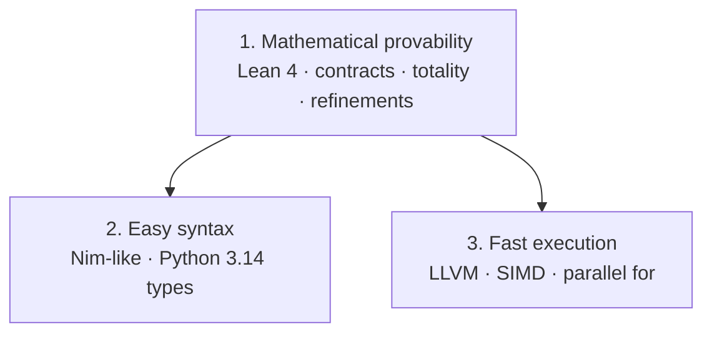
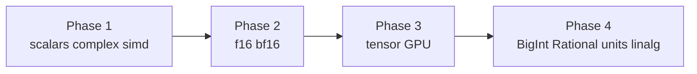
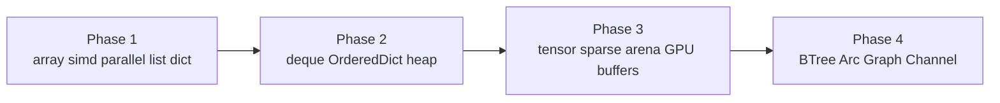

# Li Language Design Spec

> **Strict by default:** Proof, security, and performance gates are always on at maximum. There is **no optional provability** — only explicit downgrades in `li.toml` or documented env. Policy: [Strict by default](../../ecosystem/strict-by-default.md). Contracts below are **mandatory**, not opt-in.

**Date:** 2026-05-14 (rev. 5)  
**Status:** Planning  
**Milestone:** Tetris + proved physics kernels — **unproved code does not compile**
**License:** Apache-2.0 OR MIT (open source)

> **Implementation status:** Normative **target**. For what `lic` proves **today**, see [Provability gaps](../../verification/provability-gaps.md). Gaps are **compiler maturity**, not a user toggle to disable proof.

## Vision

Li is an **open-source**, **compiled**, Nim-syntax language for HPC and scientific computing. Its reason to exist is **mathematical provability**: every shipped program is a theorem the **Lean 4 kernel** accepts — not a program we merely tested or type-checked.

**Easy syntax** means code **does what it reads like it does** — influenced by Python’s readability ([PEP 20](https://peps.python.org/pep-0020/)): simple names, obvious control flow, pseudocode-friendly surface. See [Language philosophy](../../language/philosophy.md).

**Fast execution** is a co-equal product goal, but **neither clarity nor speed may weaken the proof gate**. If a feature cannot be made provable, it does not ship in user code.

## Composability (ecosystem principle)

Substantial features (HTTP gateway, benchmark harness, package tooling) ship as **small, importable APIs** — `serve`, `stop`, `ready` (or domain-equivalent verbs) — in `src/lib.li`, not only as monolithic `main` binaries. Other Li programs and agents compose services by `import` without copy-paste. Composability does **not** relax the proof gate: exported lifecycle `proc`s still require contracts and `lic build` discharge. See [composable-by-default.md](../../ecosystem/composable-by-default.md).

## The three pillars (priority order)



| # | Pillar | What it means | Hard gate |
|---|--------|---------------|-----------|
| **1** | **Mathematical provability** | Kernel-checked proofs of types, memory, contracts, termination, and parallel disjointness | `lic build` **fails** on any open VC |
| **2** | **Easy syntax** | Indentation, familiar typing, minimal boilerplate for experts (“vibecodeable”) | Syntax sugar must desugar to provable core |
| **3** | **Fast execution** | Native LLVM, SIMD, multi-core OpenMP in v1 | Speed opts **only** after proof; no UB shortcuts |

### Conflict resolution (binding)

When pillars collide, follow this order:

1. **Provability wins** — drop or redesign the feature (e.g. no `Any`, no unproved `parallel for`, no `unsafe`).
2. **Syntax yields** — add sugar only if elaboration to Core is proved sound in Lean.
3. **Speed yields** — `-O3`, SIMD, and OpenMP apply **after** verification; never skip Lean for release builds.

The **only** unproved surface is `docs/semantics/trusted.lean` (minimal `IO` + audited `extern`). That file is capped and RFC-reviewed; it is not a loophole for user logic.

### What “mathematically provable” requires (checklist)

Every compiling module must have:

- [ ] Python 3.14 typing (no `Any`) + refinements where values carry predicates  
- [ ] `requires` / `ensures` on every `proc`  
- [ ] `invariant` + `decreases` on every loop (`while`, `parallel for`)  
- [ ] Memory safety via borrow rules (no UB in accepted programs)  
- [ ] All proof obligations **discharged in Lean 4** (Coq-grade kernel, not SMT-only)  
- [ ] Parallel loops: **proved iteration independence** on **shared memory**
- [ ] No `sorry`, `assume`, or bare `cast` in user source  

`lic check` is IDE convenience only. **`lic build` is the proof certificate.**

## Non-negotiables

| Requirement | Interpretation |
|-------------|----------------|
| **Pillar 1 — Provability** | **Highest priority**; see checklist above; Lean 4 kernel is mandatory for `build` |
| **Pillar 2 — Easy syntax** | Nim-like surface; Python 3.14 types; sugar elaborates to provable Core |
| **Pillar 3 — Fast execution** | LLVM 18, SIMD, `parallel for` v1; no release binary without Pillar 1 |
| **Provable-only** | No compile without discharged Lean proofs; reject partial or untotal user code |
| Python 3.14 type baseline | All relevant PEP constructs **except `Any`** and gradual escapes |
| Nim-like syntax | Indentation, `proc`, `type`, `object`, `enum`, `import` |
| **Mandatory contracts** | Every `proc` has specs; loops need `invariant` + `decreases` |
| **Totality** | Non-terminating `proc` rejected unless effect is explicitly axiomatized (e.g. `IO` driver) |
| **Lean 4 gate** | `lic build` ≡ typecheck + borrow + VC gen + Lean kernel OK |
| Refinement types | Index bounds, positivity, shapes — proof-carrying where needed |
| Open source | Apache-2.0/MIT; trusted axioms in `docs/semantics/trusted.lean` |
| **CPU parallelism (v1)** | `parallel for`, `Send`/`Sync`; **proved disjoint shared memory** |
| **Shared memory safety (v1)** | Race exploits in `li-tests/race_shared_memory/` must fail compile; optional TSan on CI |
| Tetris milestone | Proved `game_step`; parallel bench kernels for MD/N-body in v1 suite |

## Compiler stack

| Layer | Choice | Rationale |
|-------|--------|-----------|
| **Compiler v0** | **C++** (LLVM-native) | Same stack as Clang/LLVM; direct C++ API, no binding layer, industry standard for LLVM frontends |
| **Compiler v∞** | **Li** (self-hosted) | Bootstrap after language is usable; dogfood |
| **Lexer** | Hand-written DFA (`li_lexer`) | Fast, no code-gen lexer dependency |
| **Parser** | Hand-written recursive descent + Pratt | Nim-like indentation control |
| **Typechecker** | C++ module `li_types/` | Python 3.14 + refinements + contract well-formedness |
| **Verifier** | `li_verify/` + **Lean 4** | VC generation; Lean kernel checks proofs (Coq-level standard) |
| **Middle-end** | Custom MIR (SSA) | Borrow lowering, **parallel regions**, simd, bounds |
| **Backend** | **LLVM 18 only** | Single codegen path; HPC peak perf, vectorization, LTO |
| **Incremental** | Per-module cache + thinLTO split | Fast rebuild; proof cache keyed by VC hash |
| **Formal semantics** | **Lean 4** (canonical) | Core calculus, typing rules, contract semantics, MIR preservation |
| **Runtime** | Minimal C (`li_rt.c`) | Panic, bounds, contract failure hooks in debug |

**Rejected hosts:** Zig (explicit), Rust for v0 (slow linker iteration on a large LLVM-linked binary — revisit only if team prefers it).

**Rejected backends:** Cranelift — one IR, one optimizer, one mental model.

**Bootstrap path:** C++ → Li (same pattern as Clang → eventually self-host, or OCaml → Rust historically).

## Python 3.14 type catalog (li mapping)

Reference: [Python 3.14 typing](https://docs.python.org/3.14/library/typing.html), [annotationlib](https://docs.python.org/3.14/library/annotationlib.html), [whatsnew 3.14](https://docs.python.org/3.14/whatsnew/3.14.html).

### 3.14-specific behavior to implement

| Python 3.14 change | Li behavior |
|--------------------|----------------|
| PEP 649/749 deferred annotations | `annotationlib`-style lazy resolve; speeds large-module `check` |
| `int \| str` unified with `Union` | Only `\|` syntax in surface; single `Union` internal type |
| `TypeAliasType` star unpacking | `type Matrix[T] = *tuple[int, T]` supported |
| `io.Reader` / `io.Writer` | Preferred over deprecated `typing.IO` |
| `memoryview[T]`, `py_object` generic | `memoryview[T]` for bytes slices; no runtime `py_object` |
| PEP 750 t-strings / `Template` | `t"..."` → `Template` type (static parts + holes); safe SQL/HTML paths |
| `types.UnionType is typing.Union` | Single union representation in compiler IR |

### Scalar & builtin types

| Python | Li | Notes |
|--------|-------|-------|
| `int` | `int` | Arbitrary precision off in `fast` mode → `i64`/`i128` |
| `float` | `float64` | IEEE754 |
| `complex` | `complex128` | Required for scientific code |
| `bool` | `bool` | |
| `str` | `str` | UTF-8 owned; `LiteralString` for t-string safety |
| `bytes` | `bytes` | |
| `bytearray` | `var bytes` / mutable buffer | Linear ownership |
| `None` | `None` | Unit type `()` alias |
| `type[T]` | `type[T]` | Class objects as values |
| `Any` | **Not in Li** | Python compatibility via codegen stubs only; source rejects `Any` |

### Collections (PEP 585 builtins)

| Python | Li |
|--------|-------|
| `list[T]` | `list[T]` | Heap only with explicit `raises Alloc` |
| `dict[K,V]` | `dict[K,V]` | |
| `set[T]` / `frozenset[T]` | `set[T]` / `frozenset[T]` | |
| `tuple[T, ...]` | `tuple[T, ...]` | Homogeneous |
| `tuple[T1, T2, …]` | `tuple[T1, T2, …]` | Fixed arity |
| `deque[T]` | `deque[T]` | Phase 2 stdlib |

### Special typing forms

| Python | Li |
|--------|-------|
| `Union` / `X \| Y` | `X \| Y` |
| `Optional[T]` | `T \| None` (alias) |
| `Literal[…]` | `Literal[…]` |
| `type Name = …` (PEP 695) | `type Name = …` |
| `NewType` | `newtype Name = T` |
| `Annotated[T, m…]` | `Annotated[T, m…]` | Metadata for units/SI later |
| `Never` / `NoReturn` | `Never` | Bottom type |
| `Self` | `Self` | |
| `LiteralString` | `LiteralString` | |
| `ClassVar[T]` | `ClassVar[T]` | |
| `Final[T]` | `Final[T]` | |
| `Required` / `NotRequired` / `ReadOnly` | Same | TypedDict fields |
| `TypeGuard[T]` / `TypeIs[T]` | Same | Narrowing after `if` |
| `cast` | `cast[T](e, pf)` | **Requires proof term** `pf : SubType(e, T)`; no bare cast |
| `assert_type` / `assert_never` | Same | Compile-time |
| `overload` | `overload` | Desugar to single impl + dispatch |
| `override` | `override` | Annotation on methods |
| `dataclass_transform` | `dataclass_transform` | On `@dataclass`-like templates |

### Generics (PEP 695)

```nim
type Vec[T] = object
  data: ptr T
  len: int

proc map[T, U](xs: list[T], f: proc(x: T) -> U) -> list[U] = ...
```

- `TypeVar`, `TypeVarTuple`, `ParamSpec`, `Concatenate`, `Unpack` — all supported in checker
- Deprecated `Generic[T]` class syntax → PEP 695 `type` / bracket params only

### Protocols & ABCs (PEP 544, collections.abc)

Structural typing for: `Iterable`, `Iterator`, `Sized`, `Callable`, `Mapping`, `Sequence`, `Hashable`, `Awaitable`, `AsyncIterator`, `ContextManager`, `Reader`, `Writer`, and `Protocol` user types.

Nominal: `object` inheritance still primary for li `object`/`enum`.

### Callable

`Callable[[A, B], R]` and `proc(a: A, b: B) -> R` interchangeable in annotations.

`ParamSpec` for decorators: `Concatenate[Lock, P]` patterns.

### TypedDict, NamedTuple

```nim
type Point = tuple[x: float, y: float]  # NamedTuple

type Config = typedict
  host: str
  port: NotRequired[int]
```

### Enums

`enum`, `IntEnum`, `StrEnum`, `Flag` — Nim `enum` + backing type annotations.

### Generators & async

| Python | Li |
|--------|-------|
| `Generator[Y, S, R]` | `generator[Y, S, R]` |
| `Iterator[T]` / `Iterable[T]` | Same |
| `Coroutine` / `Awaitable` | `async`/`await` with effect `raises Async` |
| `AsyncGenerator` | Phase 2 |

### Scientific / HPC extensions (beyond Python)

See **Numeric roadmap** for full scalar schedule. Summary:

| Li-only | Purpose |
|------------|---------|
| `array[N, T]` | Stack/static grid; compile-time indices |
| `simd[T, N]` | Explicit CPU vector lanes (**v1**) |
| `parallel for` / `par_reduce` | **v1** — multi-core CPU; OpenMP lowering |
| `tensor[Shape, T]` | Phase 3 — shape in type (numpy/jaxtyping direction) |
| `checked int` / `wrapping int` | Explicit overflow modes |
| `raises Alloc` / `raises IO` / `raises DivZero` | Effect tracking |

### Deprecations we skip (not in li)

- `typing.IO` / `TextIO` / `BinaryIO` → use `Reader`/`Writer`
- `typing.Generic` old syntax → PEP 695 only
- `typing.AnyStr` → `class C[T: (str, bytes)]`
- `typing.TypeAlias` assignment form → `type` statement
- Runtime `isinstance` on complex `typing` objects — li is static; runtime reflection limited

## Numeric roadmap

Li numerics are **Python 3.14 at the surface** (names and habits) but **compiled and fixed-width under the hood**. This section is the single source of truth for scalar types, overflow, operators, and what ships when.

### Phase 1 — v1 scalars (Tetris + typechecker)

#### Default types (Python names → machine types)

| Surface | Backing | Notes |
|---------|---------|-------|
| `int` | `i64` | Default signed integer; not arbitrary-precision |
| `uint` | `u64` | Unsigned; no implicit mixing with `int` |
| `float` | `float64` | IEEE-754 binary64; Python `float` parity |
| `complex` | `complex128` | `{ re: float64, im: float64 }` |
| `bool` | `bool` | Logical only; **not** a subtype of `int` |

#### Fixed-width types (explicit HPC/systems)

| Signed | Unsigned | Float | Complex |
|--------|----------|-------|---------|
| `i8` `i16` `i32` `i64` `i128` | `u8` `u16` `u32` `u64` `u128` | `f32` / `float32` | `complex64` / `c64` |
| `isize` | `usize` | `f64` / `float64` | `complex128` / `c128` |

No silent widening: `i32 + i64` is a type error unless explicitly cast.

#### Overflow modes

Applied per type (e.g. `wrapping i32`, `checked int`):

| Mode | Behavior | Where allowed |
|------|----------|---------------|
| **checked** (default) | Must prove no overflow or use refinement bounds | All compiled code |
| **wrapping** / **saturating** | Allowed only with proved `ensures` linking to mathematical model | Explicit |
| **unchecked** | **Not in language** | — |

#### Literal suffixes

```
42       # int   → i64
42u      # uint  → u64
42i32    # i32
42u8     # u8
3.14     # float64
3.14f32  # f32
2.0 + 1.0i   # complex128
```

#### Operator rules (v1)

| Rule | Behavior |
|------|----------|
| Mixed `int` + `float` | **Error** unless explicit cast (catches science bugs) |
| Mixed `int` + `uint` | **Error** unless explicit cast |
| `float` → `complex` | Allowed (widening) |
| `complex` → `float` | **Error** (narrowing requires cast) |
| `/` on ints | **float** result (Python 3): `5 / 2` → `2.5` |
| `//` on ints | Floor division toward −∞ (Python 3) |
| `%` | Same sign convention as Python 3 |
| `**` | `float` base → `float`; `int` base + `int` exp → `int` if representable, else error |

#### Effects tied to numerics

| Operation | Effect |
|-----------|--------|
| `/` with zero divisor | `raises DivZero` (or compile error if divisor is literal `0`) |
| Checked overflow | `raises Overflow` in debug; compile-time reject when provable |
| `sqrt` of negative `float` | `raises Float` or returns `complex` — pick at impl (default: `raises Float`) |

#### SIMD vectors (v1)

Explicit packed lanes for HPC kernels. Scalar loops may still auto-vectorize via LLVM; `simd` types are for **deterministic** lane-wise code.

```nim
type Vec4f = simd[f32, 4]
type Vec8f = simd[f32, 8]
type Vec4i = simd[i32, 4]

proc add(a, b: Vec4f) -> Vec4f =
  return a + b   # elementwise; lowers to LLVM vector add

proc dot(a, b: Vec4f) -> f32 =
  return horizontal_sum(a * b)
```

| Surface | Rules |
|---------|-------|
| `simd[T, N]` | `T` ∈ `{ i8…i64, u8…u64, f32, f64 }`; `N` ∈ `{ 2, 4, 8, 16, 32, 64 }` (subset per target) |
| Lane count | Must match target capability at codegen or compile error (no silent scalar fallback) |
| Conversions | `simd[f32, N](scalar)` splats; `simd[f32, N](array[N, f32])` loads from contiguous memory |
| Memory | `load`/`store` require aligned pointer or `raises Align`; unaligned load is explicit intrinsic |
| Interop | `array[N, T]` and `tensor` slices may convert to `simd[T, N]` when contiguous and aligned |
| Target flags | `lic build --target-cpu=native` enables AVX2/AVX-512/NEON per LLVM |

**Stdlib (v1):** `horizontal_sum`, `horizontal_max`, `fma`, `shuffle`, `blend`, `dot` for `simd[f32/f64, N]`.

**Codegen:** MIR `simd` ops → LLVM vector types (`<4 x float>` etc.); ISAs: x86 SSE/AVX/AVX-512, AArch64 NEON. Milestone: SIMD micro-benchmark beats equivalent scalar loop at `-O2`.

#### Explicitly **not** in v1

- `unchecked int`, runtime-only bounds without proof
- SIMD without target proof or explicit `requires` alignment preconditions

---

### Phase 2 — half precision

#### `f16` / `bf16` (16-bit floats)

| Type | Layout | Use case |
|------|--------|----------|
| `f16` / `float16` | IEEE half: 1 + 5 exp + 10 mantissa | GPU/CPU FP16 paths; half memory vs `f32` |
| `bf16` / `bfloat16` | 1 + 8 exp + 7 mantissa | ML training; same range as `f32`, less precision |

Requires: hardware feature detection, explicit conversion rules (`f32` ↔ `bf16` never silent in narrowing direction), and LLVM FP16/bf16 codegen support on target triple.

---

### Phase 3 — shaped arrays & GPU

| Feature | Purpose |
|---------|---------|
| `tensor[Shape, T]` | Shape in the type — e.g. `tensor[(3, 3), f64]` vs `tensor[(3,), f64]`; dimension errors at compile time |
| `array[N, T]` (v1) | Fixed rank-1/2 stack arrays; Tetris boards, small grids |
| GPU buffers `device[T]` / `host[T]` | Separate address spaces; copy semantics explicit |
| Kernel `gpu proc` | Entry points for CUDA / Metal / Vulkan compute (one backend chosen first) |

Depends on Phase 1 numerics (including SIMD) and a stable MIR → LLVM path (or secondary GPU IR).

---

### Phase 4 — exact & extended numerics (scientific stdlib)

| Type / module | Purpose |
|---------------|---------|
| `BigInt` | Arbitrary-size integers (opt-in; not default `int`) |
| `BigRational` / `Rational` | Exact fractions `numer / denom` |
| `Fixed[Scale]` | Fixed-point integers with compile-time scale |
| `Decimal` | Base-10 exact decimals (finance, reporting) |
| `units` | `Quantity[f64, M]` vs `Quantity[f64, S]` — dimensional analysis |
| `linalg` | Typed `dot`, `solve`, decompositions on `tensor` |
| `fft`, `ode`, `stats` | Domain libraries on `f64` / `complex128` |

These live in **std**, not the language core. The compiler only needs stable scalar and `tensor` foundations.

---

### Roadmap summary



| Phase | Milestone gate |
|-------|----------------|
| 1 | Tetris compiles; numeric/SIMD type errors caught; SIMD dot benchmark beats scalar at `-O2` |
| 2 | `f16`/`bf16` conversion tests pass on hardware that supports them |
| 3 | `tensor[(N,M), f64]` matmul on CPU; optional GPU buffer copy |
| 4 | `units` test: adding `m` + `s` is a compile error |

## Data structures roadmap

Python’s `dict` **is** a hash table — we expose one user-facing `dict[K,V]` type (open addressing or Swiss-table style internally; not a separate public `Hashtable` type). Same for `set[T]`. This section lists every aggregate the language and stdlib need, when they ship, and how memory works.

### Terminology

| User-facing type | Implementation (typical) | Memory |
|------------------|--------------------------|--------|
| `array[N, T]` | Stack or static fixed buffer | No heap; size in type |
| `list[T]` | Dynamic array (`Vec`) | Heap; `raises Alloc` |
| `dict[K, V]` | Hash map | Heap; `raises Alloc` |
| `set[T]` | Hash set | Heap; `raises Alloc` |
| `object` / `tuple` | Struct / product type | Stack or inline in parent |
| `enum` | Tagged union (discriminant + payload) | Stack |
| `Option[T]` | Maybe / nullable without null | Inline |
| `tensor[Shape, T]` | Contiguous shaped buffer | Heap or arena; Phase 3 |

---

### Phase 1 — v1 (Tetris + core checker)

Built into the **language** or minimal **std** — enough to write games and typed algorithms.

#### Fixed arrays — `array[N, T]`

```nim
type Board = array[20, array[10, Cell]]
var row = board[3]
board[3][4] = Cell(color: Cyan)
```

- `N` must be a compile-time constant
- Literal index out of range → **compile error**
- Dynamic index requires refinement type or proof — no unproved runtime-only bounds in release builds
- Multidimensional = nested `array`, or row-major flat `array[N*M, T]` in std

#### SIMD + parallelism (v1)

Packed lanes **and** `parallel for` are both **v1**. See **Parallelism & multi-core execution (v1)**.

#### Product & sum types

| Form | Python analog | Li |
|------|---------------|-------|
| `object` | `@dataclass` / Nim `object` | Nominal fields, methods |
| `tuple[A, B, …]` | `tuple` | Fixed arity, heterogeneous |
| `type P = tuple[x: float, y: float]` | `NamedTuple` | Field names in type |
| `enum` | `enum` / `IntEnum` | `enum` with optional backing `int` |
| `Option[T]` | `Optional[T]` / `T \| None` | No null pointers |

#### Strings & byte buffers

| Type | Role |
|------|------|
| `str` | UTF-8 owned string; heap; `raises Alloc` |
| `stringview` | Borrowed UTF-8 slice `(*u8, len)` |
| `bytes` | Immutable byte sequence |
| `bytearray` / `var bytes` | Mutable buffer; unique ownership |
| `memoryview[T]` | Typed slice over any contiguous buffer (PEP 3.14 generic) |

#### Heap collections (Python names, explicit allocation)

| Type | Python | Notes |
|------|--------|-------|
| `list[T]` | `list` | Amortized O(1) push/pop end; `len`, indexing, iteration |
| `dict[K, V]` | `dict` | Hash table; `K` must be `Hash`able |
| `set[T]` | `set` | Hash set; mutable |
| `frozenset[T]` | `frozenset` | Immutable hash set; hashable itself |

All heap collections require effect `raises Alloc` on growth. Iteration borrows immutably; `mut` access needs `borrow mut` or owned value.

#### Typed records

```nim
type Config = typedict
  host: str
  port: NotRequired[int]
  token: ReadOnly[str]
```

Structural dict type for APIs — compile-time field checking, lowered to `dict[str, T]` or struct at runtime (implementation choice; checker enforces fields either way).

#### Hashing contract

```nim
type Hash = trait
  proc hash(self: Self) -> u64
  proc eq(self: Self, other: Self) -> bool
```

`dict`/`set` keys must implement `Hash` (nominal `object`/`enum` derive automatically; newtypes opt in).

#### What v1 does **not** include

- `deque`, `OrderedDict`, `Counter`, `defaultdict` (stdlib Phase 2)
- `tensor` / n-dimensional heap arrays
- Linked lists, trees, graphs (stdlib only, if ever)
- Weak references, GC’d shared mutability

---

### Phase 2 — Python stdlib parity & algorithmic containers

| Type | Python | Implementation |
|------|--------|----------------|
| `deque[T]` | `collections.deque` | Ring buffer on heap |
| `OrderedDict[K,V]` | `collections.OrderedDict` | `dict` + insertion list |
| `Counter[T]` | `collections.Counter` | `dict[T, int]` newtype |
| `defaultdict[K,V]` | `collections.defaultdict` | Wrapper with default factory |
| `PriorityQueue[T]` | `heapq` | Binary heap on `list[T]` |
| `LinkedList[T]` | rare in Python | Intrusive list only if profiling demands |

Also: `sort`, `binary_search`, `heap_push/pop` on slices and lists.

---

### Phase 3 — HPC & scientific shapes

| Type | Purpose |
|------|---------|
| `tensor[Shape, T]` | N-d contiguous array; shape in type |
| `tensorview[Shape, T]` | Borrowed subtensor / slice |
| `sparse[Csr, T]` / `sparse[Csc, T]` | Sparse linear algebra |
| `grid[N, M, T]` | Alias for 2D tensor + boundary helpers (stencil codes) |
| `ringbuffer[N, T]` | Fixed-capacity FIFO without alloc |
| `arena` / `pool[T]` | Bump allocator for simulation timesteps |

GPU side (with numeric Phase 3):

| Type | Purpose |
|------|---------|
| `devicebuffer[T]` | GPU-owned contiguous storage |
| `hostbuffer[T]` | Pinned/pageable host mirror |
| `ndview[Shape, T]` | View with strides (non-contiguous) |

---

### Phase 4 — advanced & domain structures

| Type | Purpose |
|------|---------|
| `BTreeMap[K,V]` / `BTreeSet[T]` | Ordered maps without hash; range queries |
| `RoaringBitmap` | Compressed sets (scientific indexing) |
| `Graph[N, E]` | Static graph with typed node/edge counts |
| `Table[K, V]` | Immutable persistent map (functional updates) |
| `Channel[T]` | Async/thread message queue |
| `Arc[T]` / `Rc[T]` | Shared ownership when borrow is too tight (opt-in; `raises Alloc`) |

Only added when a real benchmark or library needs them — not language builtins.

---

### Memory & safety rules (all phases)

| Rule | Applies to |
|------|------------|
| Owner destroys / deallocates | `list`, `dict`, `set`, `str`, `tensor` |
| `borrow imm` for read loops | iteration over any collection |
| `borrow mut` exclusive | `bytearray`, in-place `list` algorithms |
| Heap `list`/`dict`/`set` | `raises Alloc` — effect tracked; alloc laws in `trusted.lean` until proved |
| `frozenset` / immutable views | hashable; share immutably without extra proof |
| Interior mutability | **not** in v1 (`Cell[T]` Phase 4 if needed) |

---

### Roadmap summary



| Phase | Milestone gate |
|-------|----------------|
| 1 | Tetris + **parallel** MD/N-body bench; SIMD + `parallel for`; `dict`/`list` |
| 2 | Port one Python `collections` micro-module with parity tests |
| 3 | `tensor[(N,M), f64]` + slice; one stencil benchmark |
| 4 | Document when to pick `dict` vs `BTreeMap` vs `tensor` |

## Parallelism & multi-core execution (v1)

Li **v1 ships CPU multi-core parallelism**, not only SIMD. HPC without `parallel for` is a non-starter. Parallelism stays **provable-only**: races and unsynchronized shared mutation are **compile errors**.

### Three layers

| Layer | Hardware | v1? | Example |
|-------|----------|-----|---------|
| **SIMD** | One core, many lanes | **Yes** | `simd[f64, 8]` dot |
| **CPU multi-core** | Many cores, shared RAM | **Yes** | MD force loop, `matmul` tiles |
| **GPU** | SIMT device | Phase 4+ | Large offload kernels |

### `parallel for` (v1)

```nim
parallel for i in 0..<N
  requires disjoint_tile(i, grid)
  ensures tile_ok(i, grid)
  decreases N - i
=
  compute_tile(grid, i)
```

| Feature | v1 | Lowers to |
|---------|-----|-----------|
| `parallel for` | **Yes** | LLVM + **OpenMP** (`llvm.loop.parallel` / libomp) |
| `par_slice[array, range]` | **Yes** | Refinement: disjoint mutable partition |
| `Send[T]` / `Sync[T]` | **Yes** | Thread-safety traits; required for captured data |
| `par_reduce` | **Yes** | Proved associative `op` + `ensures` on identity |
| `thread_pool` | **Yes** | `std/parallel` — fixed workers, proved task closures |
| `spawn` / unstructured threads | **No** | Too hard to prove in v1 — structured only |

`lic build --threads=N` sets OpenMP team size (default: machine cores).

### Provable-only rules (v1)

- `parallel for` **rejected** unless Lean discharges **iteration independence** (disjoint indices / immutable shared read).
- `borrow mut` across iterations **rejected** without disjointness proof.
- Read-only parallel loops over `borrow imm` / immutable data: always allowed.

### Borrow + parallel (v1 MD pattern)

```nim
# Positions immutable this step; forces written to disjoint f[i]
parallel for i in 0..<N
  requires forall j, k, tile(i, j) and tile(i, k) and j != k ==> force_index(j) != force_index(k)
  decreases N - i
=
  compute_force_i(positions, forces, i)
```

### SIMD + multi-core together (v1)

Inner loop: `simd`; outer loop: `parallel for`. Standard li HPC idiom — both required in v1 benchmarks.

### GPU (not v1)

`gpu proc` and `devicebuffer` remain **Phase 4+**. v1 competes on **multi-core CPU + SIMD** vs C++/Rust/Julia.

### Benchmarks (v1)

Tier 2 (`three_body`, `md_lennard_jones`) **must** ship **proved `parallel for`** li builds before perf tables. Report 1-thread and N-thread columns from day one of v1.

### Shared memory model (v1)

OpenMP worker threads share **one process address space** (POSIX shared memory). Li does **not** expose raw threads or locks in v1; shared RAM is accessed only through constructs the compiler can prove race-free.

| Mechanism | Shared memory use | Safety |
|-----------|-------------------|--------|
| `parallel for` + **proved disjoint** writes | Each iteration touches disjoint `array`/`tensor` slices | **Compile-time** reject if overlap |
| `borrow imm` shared read | All threads read same immutable / imm-borrowed data | Allowed without extra proof |
| `par_slice[a, r]` | Mutable partition with refinement `range(i) ∩ range(j) = ∅` for `i ≠ j` | Type + Lean discharge |
| `Send[T]` / `Sync[T]` | Values captured into parallel regions | Required; laws in `Core.lean` |
| `par_reduce` | Combine partial results | Requires proved associative `op` + `ensures` |
| `Mutex[T]` / atomics | — | **Not in v1** (use disjoint partitions instead) |

**Guarantee (v1):** If `lic build` succeeds, the program has **no data races** on user `var` / mutable buffers under the Li memory model. Violations are **compile errors**, not TSan surprises at runtime.

**Debug-only:** `LI_RT_TSAN=1` links ThreadSanitizer on CI nightly to catch compiler bugs — not a user safety net.

### Race-reject test suite (v1, mandatory CI)

Deliberate exploit attempts in `li-tests/race_shared_memory/*.li` **must fail** `lic build` with a diagnostic citing **shared memory / disjointness / Send / Sync**. Run on every PR:

```bash
./li-tests/run_all.sh race_shared_memory
# or: ./scripts/test_race_reject.sh
```

| Fixture | Exploit | Expected error |
|---------|---------|----------------|
| `shared_mut_write.li` | Two iterations write `buf[0]` | overlapping mutable access |
| `overlap_par_slice.li` | `par_slice` ranges intersect | refinement / disjoint proof fails |
| `missing_disjoint_clause.li` | `parallel for` without `disjoint_*` | missing parallelism proof |
| `mut_capture_no_sync.li` | Capture `var counter` in parallel body | `Sync` / capture violation |
| `borrow_mut_across_iters.li` | `borrow mut` whole buffer in parallel loop | borrow + disjoint conflict |
| `false_disjoint_proof.li` | `requires disjoint_tile` but body aliases | Lean / VC rejection |

Positive control: `li-tests/race_shared_memory/good_disjoint_parallel.li` **must** `lic build` — paired MD tile loop with valid proof.

## Contracts & formal verification (provable-only)

**If Lean does not accept the proof, `lic build` fails.** There is no optional verification tier, no `unsafe`, no `sorry`, no `Any`, no bare `cast`.

Li combines **Python 3.14 types (minus `Any`)**, **mandatory Hoare contracts**, **refinement types**, **totality**, and **Lean 4 kernel checking** — the same assurance class as **Coq** / **Lean** total correctness (not SMT-only).

> **Coq:** Lean 4 is the primary proof engine. Coq export remains Phase 7+.

### What may compile

| Requirement | Reject if missing |
|-------------|-------------------|
| Well-typed (Python 3.14 subset) | Type error |
| Borrow / memory safe | Borrow error |
| `requires` / `ensures` on every `proc` | Spec error |
| `invariant` + `decreases` on every loop | Totality error |
| All VCs discharged in Lean 4 | **Compile rejected** |
| `extern proc` | Must carry full contract; body trusted and listed in `trusted.lean` |

### What is forbidden in source

| Construct | Status |
|-----------|--------|
| `Any` | **Syntax error** |
| `unsafe`, `safe`, `verified` modifiers | **Removed** — everything is provable or rejected |
| `sorry`, `admit`, `assume` in user code | **Rejected** |
| Bare `cast[T](e)` | **Rejected** — use `cast[T](e, proof)` |
| `while` without `decreases` | **Rejected** |
| `proc` without specs | **Rejected** |
| Unchecked overflow | **Rejected** |
| Dynamic index without proof or refinement | **Rejected** |

### Trusted base (only escape hatch)

The **only** unproved code is the minimal **trusted runtime** axiomatized in `docs/semantics/trusted.lean`:

- `IO` primitives (`read_input`, `present_frame`, SDL hooks) as abstract monad axioms
- `Alloc` allocator laws (or no heap until alloc proofs exist)
- LLVM codegen correctness (until translation validation proves preservation)

**All user `.li` modules** — including Tetris logic and physics kernels — must prove. The game **step function** is proved; the OS loop calls it via trusted `IO`.

### Contract syntax (mandatory on every `proc`)

```nim
proc sqrt(x: float) -> float
  requires x >= 0.0
  ensures result >= 0.0
  ensures abs(result * result - x) < 1e-12
  decreases 0
=

proc verlet_step(
    pos: var tensor[(N, 3), f64],
    vel: var tensor[(N, 3), f64],
    dt: f64
) -> unit
  requires dt > 0.0
  requires N > 0
  ensures abs(total_energy(pos, vel) - old(total_energy(pos, vel))) <= energy_bound(dt)
  decreases 1
=
  var i: {k: int | 0 <= k and k <= N} = 0
  while i < N
    invariant 0 <= i and i <= N
    invariant symmetry_momentum(pos, vel)
    decreases N - i
    ...
    i += 1
```

| Clause | Role |
|--------|------|
| `requires` | **Mandatory** precondition |
| `ensures` | **Mandatory** postcondition (`result`, `old(e)`) |
| `invariant` | **Mandatory** on every `while` |
| `decreases` | **Mandatory** on every `proc` and `while` |
| `assert` | Local VC — must close |
| `axiom` | **Only** in `docs/semantics/trusted.lean`, never user modules |

### Refinement types (proof-carrying)

```nim
type PosInt = {x: int | x > 0}
type Index20 = {i: int | 0 <= i and i < 20}

proc row(board: Board, i: Index20) -> array[10, Cell]
  ensures true
  decreases 0
=
  ...
```

Dynamic indices become refinements or explicit proof terms — no silent runtime-only checks in compiled release code without a proved bound.

### Proof blocks

```nim
theorem energy_bounded(dt: f64) -> unit
  requires dt > 0.0
  ensures ...
  decreases 0
  = proof
    ...
  qed
```

All `theorem` / `lemma` bodies must compile to closed Lean terms. **No `sorry`.**

### Compilation pipeline (proof is not optional)

```
.li
  → parse → typecheck (no Any)
  → contract + totality well-formedness
  → VC generation → Lean 4 goals
  → lean (kernel) — **STOP if any goal open**
  → borrow check → MIR → LLVM
```

| Command | Emits binary? |
|---------|----------------|
| `lic check` | **No** — IDE-fast type + spec skeleton only |
| `lic build` | **Yes** — only if Lean accepts all proofs |

### What Lean proves

| Layer | Mechanism |
|-------|-----------|
| Types + refinements | C++ checker → Lean export for refinement obligations |
| Memory | Borrowck + Lean lemmas on ownership |
| Contracts | Lean 4 kernel |
| Termination | `decreases` → Lean `termination_by` |
| Science benchmarks | User-stated `ensures` (energy, momentum, stability) |

### Honesty boundary

- **Provable** = your specs + Lean agree; wrong `ensures` → wrong theorem.
- **Trusted** = only `trusted.lean` + audited `extern` contracts — keep this surface tiny.
- The **C++ compiler** implementing the pipeline is not meta-proved yet.

## Compiler pipeline

```
.li
  → lex → parse → name resolve
  → deferred annotation resolve (PEP 649 style)
  → typecheck (Python 3.14 − Any + refinements)
  → mandatory contracts + totality check
  → VC generation → Lean 4 kernel (**hard gate**)
  → borrow check → MIR (simd + **parallel** regions) → LLVM IR + OpenMP
  → link li_rt (trusted IO only)
```

## Repository layout (C++)

```
li/
  compiler/           # C++17: lexer, parser, types, mir, llvm_codegen
  runtime/li_rt.c
  std/                # li standard library (.li)
  lib/                # shipped as bitcode or source
  examples/tetris/
  benchmarks/           # perf harness (see also li-tests/benchmarks/)
  li-tests/          # **all conformance tests** — manifest.toml + run_all.sh
  docs/semantics/     # Lean 4
  LICENSE-MIT
  LICENSE-APACHE
```

## Phased delivery (realistic)

| Phase | Scope | Duration (indicative) |
|-------|-------|------------------------|
| 0 | C++ CMake workspace, LLVM hello | 2–3 weeks |
| 1 | Lexer/parser Nim syntax | 3–4 weeks |
| 2 | Python 3.14 type core | 8–12 weeks |
| 2e | Contracts, refinements, VC generation | 6–10 weeks |
| 2f | Lean 4 `lic verify` | 8–12 weeks |
| 3 | MIR + LLVM + **OpenMP parallel** codegen | 6–8 weeks |
| 4 | Collections, enums, TypedDict, effects | 6–8 weeks |
| 5 | Tetris + SDL2 | 3–4 weeks |
| 5b | **Verified** physics/ML benchmarks | 4–8 weeks |
| 6 | Self-host | 6+ months |
| 7 | Mathlib, nonlinear reals, optional Coq export | ongoing |

**Benchmark plan:** `docs/superpowers/plans/2026-05-14-benchmarks-and-simulations.md`

## Validation suite (beyond Tetris)

| Tier | Examples | Proves |
|------|----------|--------|
| 0 | shape/type traps, energy single-step | Compiler catches science bugs |
| 1 | SIMD dot, matmul, **parallel MD slice** | LLVM SIMD + OpenMP |
| 2 | three-body, MD Lennard-Jones, heat/wave PDE, double pendulum | Physics correctness + perf vs C++/Rust/Julia/Python |
| 3 | MLP forward/train, conv2d, MNIST subset | ML kernel path vs NumPy/PyTorch CPU |
| 4 | water box MD, Barnes–Hut, ResNet infer | Integration credibility |

Cross-language comparisons use shared `params.toml`, correctness invariants before timing, single- and multi-thread columns.

## Tetris success criteria

- [ ] `lic build examples/tetris/main.li -o tetris --release`
- [ ] Board `array[20, array[10, Cell]]` literal OOB → compile error
- [ ] `lic check` < 500ms on tetris sources
- [ ] Parity tests: subset of typeshed stubs typecheck equivalently (mypy baseline)
