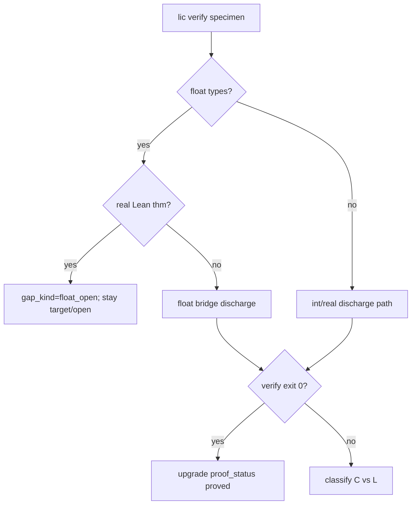

# Float vs real discharge policy (BUG-L-01)

**Audience:** proof explorer agents, catalog maintainers, compiler reviewers  
**Phase:** Proof Explorer Phase 5 WP-DS-04  
**North star fit:** Mathematical provability — no silent `proved` upgrades for float specimens under real semantics.

## Problem

Several catalog rows use **float** specimens (`float` types, IEEE-style ops) while referencing **real-valued** Lean theorems or `ensures` clauses written as if over ℝ. Discharging float code against real theorems without an explicit bridge is a **logic/catalog** failure (BUG-L-01), not a compiler bug.

## Policy

| Specimen domain | Lean target | Allowed `proof_status` | Required `gap_kind` |
|-----------------|-------------|------------------------|---------------------|
| `int` / discrete | `Int` / Peano | `proved` when `lic verify` exit 0 | `proof_gap` or none |
| `float` / IEEE | Real / Float axiom layer | **`target` or `open` only** until float bridge proved | **`float_open`** |
| Mixed (float spec, real thm) | Discharge placeholder | **`target`** with discrepancy note | **`float_open`** |

### Rules

1. **Never** set `proof_status = proved` on a float specimen unless `lic verify` exit 0 **and** the linked Lean theorem is explicitly over float (or a documented float→real bridge is discharged).
2. Tag float specimens with `gap_kind = float_open` in catalog TOML until the float discharge bridge lands.
3. Real-valued theorems (`Li.Discharge.*` over ℝ) may remain `proved` in Lean; catalog rows pointing at float specimens stay `target`/`open`.
4. Classify verify failures: if float/real mismatch → **logic (L)**; if syntactically valid int/real specimen fails with correct Lean link → **compiler (C)**.

## Affected rows (Phase 5 seed)

| Entry ID | Specimen | Action |
|----------|----------|--------|
| `P-float-sqrt-open-bound` | `sqrt_open_bound.li` | `target` + `gap_kind=float_open` |
| `N-LM-SQRT-BOUND` | `sqrt_open_bound.li` | `open` + `gap_kind=float_open` |

## Discharge workflow

## References

- `docs/reports/compiler-audit/BUG-C-01.md` — compiler vs logic classification
- `proof-db/discrepancies.toml` — sqrt float/open_math row
- Plan: `docs/superpowers/plans/proof-explorer-phase5-discharge-sprint.md` WP-DS-04
