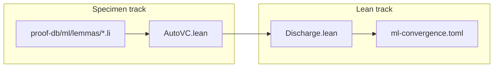

# ML convergence program (WP0-C)

**Audience:** agents extending **G-ml** / **P-ml-convergence** without collapsing training heuristics into `ensures true`.  
**Related:** [Provability gaps](provability-gaps.md) (**G-ml**) · [Proof corpus roadmap](proof-corpus-roadmap.md) (**P-ml-convergence**) · [Proof database](proof-database.md)

## Goal

Prove **optimizer-step contracts** and **convergence guards** for small, fixed-dimension training loops (SGD-class), in parallel:

1. **Specimen track** — `.li` modules under `proof-db/ml/` with `requires`/`ensures` tied to MIR witnesses.  
2. **Lean track** — lemmas in `docs/semantics/Discharge.lean` and catalog rows in `docs/verification/proof-database/entries/ml-*.toml`.

Neither track may mark `proof_status = proved` until both agree and `prove_lean_ok` (or proof-db rebuild) passes.

## Parallel tracks

| Track | Path | Deliverable (WP0-C) | Later (WP1+) |
|-------|------|---------------------|--------------|
| **Specimens** | `proof-db/ml/lemmas/` | Toy 1D/2D SGD step with literal learning rate; monotone loss **stub** `ensures` | Loop invariants + float bounds (**P-float**) |
| **Lean** | `Discharge.lean`, `proof-db/lean/ProofDB.lean` | `ML-LM-*` Props mirroring closed int slices first | Real convergence rate lemmas (axiomatic FP layer) |
| **Catalog** | `entries/ml-convergence.toml` | `ML-AX-*` modeling gaps documented; `ML-LM-*` linked to specimens | `verify-slice` in `scripts/proof-db/proof-db.py` |

## Waves

| Wave | Scope | Exit |
|------|-------|------|
| **WP0-C (this)** | Program doc + directory layout + first catalog TOML stub (no false `proved`) | **G-ml** stays **Stub**; roadmap lists **P-ml-convergence** |
| **WP1** | One closed int specimen (e.g. fixed-step descent on quadratic stub) + matching `ML-LM-001` | `prove_lean_ok` for that specimen |
| **WP2** | Float learning rate + trusted norm axioms (**G-vc**, **P-float**) | Partial **G-ml** |

## Catalog ids (planned)

| Prefix | Kind | Example statement |
|--------|------|-------------------|
| `ML-AX-*` | axiom / modeling_gap | Loss is bounded below on the training domain (stub) |
| `ML-LM-*` | lemma | One SGD step does not increase loss on a quadratic toy |

## Agent workflow

1. Read **G-ml** in [provability-gaps.md](provability-gaps.md) and **P-ml-convergence** in [proof-corpus-roadmap.md](proof-corpus-roadmap.md).  
2. Add or edit specimens under `proof-db/ml/lemmas/`; copy patterns from `contracts_verify/linalg_*_closed.li`.  
3. Add Lean only in `Discharge.lean` when the specimen’s AutoVC goal is stable.  
4. Update `entries/ml-convergence.toml` in the **same PR** as lemma or specimen changes.  
5. Run `./scripts/proof-db-rebuild.sh` and `contracts_discharge_corpus.sh` before claiming progress.

## Honesty

- Do **not** use `ensures true` on training loops to green CI.  
- Convergence **rates** and non-convex global minima stay **modeling_gap** until bench oracles exist (**5b**).  
- Full **G-ml** → **Partial** only when at least one **P-ml-convergence** row is `proved` with matching Lean and specimen.
