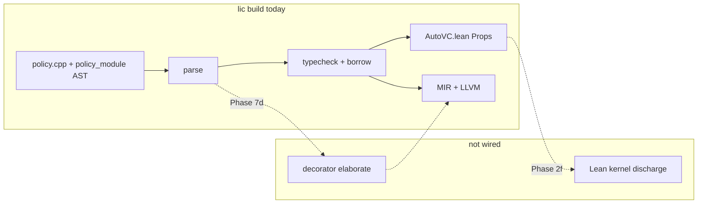

# Provability gaps (current compiler)

**Last updated:** 2026-05-25  
**Audience:** contributors, package authors, anyone relying on `lic build` as a proof certificate  

Li’s **north star** is: user logic is proved before ship; runtime failures for proved programs → **~0%**. That is the **target**, not a complete description of **`lic` today**.

**Policy vs implementation:** [Strict by default](../ecosystem/strict-by-default.md) — there is **no optional provability** by default. Rows below are **compiler maturity** (what is not wired yet), **not** permission for users to turn proof off without an explicit `li.toml` / documented downgrade.

This page is the **honest inventory** of what is **not** fully proved or not yet wired. When a gap closes, update this file in the **same PR** as the implementation.

**Related:** [Verification overview](overview.md) · [Gap closure queue](GAP_CLOSURE_QUEUE.md) (prioritized dispatch) · [Proof database](proof-database.md) (`proof-db/` release pins) · [Proof corpus roadmap](proof-corpus-roadmap.md) · [Master plan — Doc phase & compiler task map](../superpowers/plans/2026-05-14-li-master-plan.md#documentation--provability-honesty-cross-cutting) · [Trusted axioms](../semantics/README.md)

---

## Summary (read this first)

| | Target (spec) | Today (`lic` on `dev`) |
|---|----------------|-------------------------|
| **`lic build` = proof certificate** | Lean 4 kernel closes all VCs | **No** — parse, policy strings, typecheck, borrow, LLVM link only |
| **`lic check`** | Fast IDE feedback | **Yes** — no Lean, not a certificate |
| **Parallel disjointness** | Lean + structured proofs | **Partial** — AST `policy_module.cpp` (call-form `requires`; decorator `disjoint=` witness) |
| **Index bounds (release)** | Refinement / proved → no user traps | **Partial** — MIR/runtime paths still evolving |
| **Decorators (`@parallel`, …)** | Compile-time elaboration + proofs | **Partial** — parse + policy; `MirDecorator.parallel` / `vectorized`; OpenMP from `parallel for`; `contracts_discharge_corpus` MIR checks |
| **Math / linalg surface** | Static shapes, compile-time lowering | **Partial** — shape tests + **P-linalg** closed VCs (2i / 7e) |
| **Zero user runtime errors** | All above + 2f gate | **In progress** — see table below |

---

## Still open (report every session)

**Done:** **G-test-verify** (manifest `prove_lean_ok`). **Closed slices** inside **Partial** rows (e.g. P-linalg closed specimens, static `ensures` witnesses). All other **G-*** rows remain **Partial** or **Missing**.

| ID | Status | What remains |
|----|--------|----------------|
| **G-lean** | Partial | **Tier B (default when lake installed):** `lic build` runs `lake build AutoVC` (typecheck only; `--no-lean-verify` opt-out). **Strict** open goals: `--strict-lean`. Open obligations: fail unless `--allow-open-vc` (CLI only; env bypass removed). **`LiArray`** + fib/recursive call-site + parallel `_par*` VCs typecheck. **Closed slice:** `sqrt_open_bound` via trusted `Li.Discharge.sqrt_open_bound_spec`; **still open:** universal float/`abs` discharge |
| **G-vc** | Partial | `witnessed_ensures_ident.li` (`mir_return_linked=` telemetry); **closed slice:** `sqrt_open_bound` semantic discharge; loop vs closed-form `ensures` |
| **G-par** | Partial | AST `policy_module` rejects missing/weak `disjoint=` and loop `requires true`; `race_shared_memory/false_disjoint_requires_*.li`; Lean proofs open |
| **G-dec** | Partial | **Closed slice:** `MirDecorator.parallel` + `vectorized` proc tags; `lic verify mir_parallel_disjoint=` / `mir_vectorized_proc=`; `check_mir_{parallel,vectorized}_decorator.sh` in `contracts_discharge_corpus.sh`; `decorator_exploits` (5× compile_fail). **Open:** Lean **P-dec**, full decorator elaboration proofs |
| **G-math** | Partial | **Closed slice (length-1 broadcast):** `broadcast_len1_{add,mul,pow}_*.li`; `broadcast_invalid_len2_vs_len4.li` + `elementwise_len_mismatch.li` compile_fail. **Closed slice (reductions shape):** `reductions/{sum_non_array,norm_non_array,dot_len_mismatch}.li` compile_fail. **Closed slice (tier-1 perf):** `matmul_naive`, `horner_pure_li` ≤1.2× C++ when CSV refreshed. **Closed slice:** 1×2 `@` (`matmul_1x2_ok.li`); 2×2 float `@` Prop; P-linalg int corpus; loop dot open |
| **G-bnd** | Partial | Release path without `li_bounds_fail` for proved indices |
| **G-def** | Partial+ | Cross-module method privacy proofs; virtual dispatch deferred |
| **G-oop** | Partial | **Closed slice:** method call-site `requires` + int-return `ensures` in `contracts_verify/` (`discharge_method_*_lean.sh`); trait laws / `old(self.field)` open |
| **G-math-syn** | Partial | **Closed slice:** `for i in start..<end` (`math_syntax/for_range_sum.li`); Python `range()` / dynamic bounds open |
| **G-stdlib** | Partial | **Closed slice:** import-graph seal + `import_cycle` (`shadow_echo_via_import.li`, `import_cycle_a.li`); re-export override open (8a) |
| **G-narrow** | Partial | Proved width narrowing (beyond `cast[` reject) |
| **G-async** | Partial | `await` + structured concurrency proofs |
| **G-net** | Partial | Net effect codegen + proofs |
| **G-trust** | Partial+ | **T-GetElem** in `Core.lean`; `MIR.lean` preservation open |
| **G-ann** | Missing | PEP 649 deferred annotations |
| **G-gpu** | Missing | `@gpu` address-space proofs + codegen |
| **G-meta** | Missing | Compiler ↔ Lean equivalence (research) |
| **G-authz** | Missing | Capability / IDOR (OS phase) |
| **G-test-verify** | **Done** | `prove_lean_ok` in `li-tests/run_all.sh`; 18 closed `contracts_verify` specimens (incl. `sqrt_open_bound`, `refinement_{call,inline,local,guard}_ok`); `verify_ok` = strict build; lake skips when elan absent |
| **G-proof-db** | Partial | [Proof database](proof-database.md): register at `docs/verification/proof-database/entries/physics-*.toml` (`P-AX-*`, `P-LM-*`) |
| **G-physics** | Partial | **P-physics** slice: 7× `P-AX-*` + 3× `P-LM-*`; 2× proved scalar lemmas in `Discharge.lean`; tier-2 **modeling_gap** on extern stubs |
| **G-hw** | Axiomatic | FP/hardware model limit (documented, not closable) |
| **G-wrong-spec** | Social | User theorem quality (not tool-closable) |

**Proof backlog still open:** **P-refine** (`refinement_init_ok` init typing only), **P-ensures-witness**, **P-float** (universal float/`abs` beyond trusted `sqrt_open_bound`), **P-linalg** (float `@` Props; full matmul), **P-par**, **P-dec**, **P-bnd**, **P-http**, **P-narrow**, **P-meta**, **P-physics** — see [proof-corpus-roadmap](proof-corpus-roadmap.md). **P-linalg partial:** closed dot/sum/matmul-entry + **loop dot** (`linalg_dot4_int_loop_open`, `dot4_int_loop_eval_spec`); open float `vec3_dot`, 2D CallProc. **P-physics partial:** [proof-database.md](proof-database.md) index + `docs/verification/proof-database/entries/physics-*.toml` (`P-AX-*`, `P-LM-*`, pin `a9542bfc`); tier-2 wrappers still **modeling_gap** (`ensures true` on extern kernels).

### Proof-db discrepancy appendix

[`../../proof-database/DISCREPANCIES.md`](../../proof-database/DISCREPANCIES.md) — `python3 scripts/proof-db/compare_reference.py --write`. Kinds: `missing_lemma`, `open_vc`, `spec_drift`, `trusted_axiom`, `hardware_axiom` (**G-hw**).

### Proof-db discrepancy appendix

[`../../proof-database/DISCREPANCIES.md`](../../proof-database/DISCREPANCIES.md) — `python3 scripts/proof-db/compare_reference.py --write`. Kinds: `missing_lemma`, `open_vc`, `spec_drift`, `trusted_axiom`, `hardware_axiom` (**G-hw**).
| **G-test-verify** | **Done** | `prove_lean_ok` in `li-tests/run_all.sh`; 15 closed `contracts_verify` specimens; `verify_ok` = strict build; lake skips when elan absent |
| **G-proof-db** | Partial | [Proof database](proof-database.md): `entries/math-*.toml` (`M-AX-*`, `M-LM-*`, `ProofDbMath`); register at `docs/verification/proof-database/entries/physics-*.toml` |
| **G-physics** | Partial | **P-physics** slice: `P-AX-*` / `P-LM-*` in `docs/verification/proof-database/entries/physics-*.toml`; 2× proved scalar lemmas in `Discharge.lean`; tier-2 **modeling_gap** on extern stubs |
| **G-hw** | Axiomatic | FP/hardware model limit (documented, not closable) |
| **G-wrong-spec** | Social | User theorem quality (not tool-closable) |

**Proof backlog still open:** **P-refine** (init/inline/guard refinements), **P-ensures-witness**, **P-float**, **P-linalg** (float `@` Props; full matmul), **P-par**, **P-dec**, **P-bnd**, **P-http**, **P-narrow**, **P-meta**, **P-physics** — see [proof-corpus-roadmap](proof-corpus-roadmap.md). **P-linalg partial:** closed dot/sum/matmul-entry + **loop dot** (`linalg_dot4_int_loop_open`, `dot4_int_loop_eval_spec`); open float `vec3_dot`, 2D CallProc. **P-physics partial:** [proof-database.md](proof-database.md) index + `docs/verification/proof-database/entries/physics-*.toml` (`P-AX-*`, `P-LM-*`, pin `a9542bfc`); tier-2 wrappers still **modeling_gap** (`ensures true` on extern kernels).

!!! warning "Do not overclaim in docs or packages"
    Until **Phase 2f** lands, saying “`lic build` proves your program in Lean” is **aspirational**. Prefer: “`lic build` runs the current static gate; see [provability gaps](provability-gaps.md).”

---

## Gap register

Status legend: **Missing** · **Stub** · **Partial** · **CI only** · **Done**

| ID | Area | Spec / promise | Current state | Phase | How we know |
|----|------|----------------|---------------|-------|-------------|
| **G-lean** | Lean 4 gate | `lic build` fails if any VC open | **Partial** — static witnesses + **P-linalg** + **P-float** (`sqrt_open_bound`) closed slices; kernel not universal certificate | **2f** | `discharge_sqrt_open_lean.sh`, `contracts_discharge_corpus.sh`, `check-autovc-open-goals.sh` |
| **G-vc** | VC generation | Contracts → proof obligations | **Partial** — semantic `sqrt_open_bound` discharge + witnessed ensures; general float `abs` still open | **2e** | `vc_emit_lean.cpp`, `discharge_sqrt_open_lean.sh` |
| **G-par** | `parallel for` safety | Proved iteration independence | **Partial** — AST `check_module_policies` (call-form `requires disjoint_*`; decorator `disjoint=`) | **7b**, **7d-c** | `race_shared_memory/` (9 rows), `decorator_exploits/` |
| **G-stdlib** | Prelude / std seal | User cannot shadow builtin or `std/` names | **Partial** — **closed slice:** `check_stdlib_seal` on entry + each resolved import; `import_cycle` at load; workspace `std.*` / path deps; re-export override open (**8a**) | **4s** | `li-tests/stdlib_seal/` (6 compile_fail incl. `shadow_echo_via_import.li`), `li-tests/modules/import_cycle_a.li` |
| **G-dec** | Execution decorators | Static elaboration; reserved names; no runtime | **Partial** — **closed slice:** `MirDecorator.parallel` + `vectorized`; `lic verify` MIR telemetry; `check_mir_{parallel,vectorized}_decorator.sh` in corpus; 5× `decorator_exploits` compile_fail; OpenMP from `parallel for` | **7d** | `decorator_exploits/`, `decorators/vectorized_dot_proc_ok.li`, `contracts_discharge_corpus.sh` |
| **G-math** | Math / `A @ B` | Shape errors at compile time; no user `simd(...)` | **Partial** — length-1 broadcast + reduction shape compile_fail; 1d/2d `@`; tier-1 advisory | **2i**, **7e**, **2f** | `li-tests/math_linalg/`, `discharge_linalg_int_lean.sh` |
| **G-bnd** | Bounds in release | No reliance on `li_bounds_fail` for proved indices | **Partial** — [bounds-release-path](bounds-release-path.md); `check_release_bounds_ir.sh`; dynamic debug traps not wired | **2e**, **3** | `bounds_refinement_release_ok.li`, `discharge_refinement_lean.sh` |
| **G-def** | `def` / `object` / visibility | Handbook surface | **Partial+** — methods/`self`, `private def`, MIR in-out write-back (**2j-a/b/c**); inheritance/traits open (**2j-d–f**) | **2j** | `li-tests/encapsulation/`, `composable/import_physics_runtime.li` |
| **G-oop** | Full OOP | Methods, traits, inheritance, cross-module encapsulation | **Partial** — **2j-a…f** surface + **P-oop partial:** folded method call-site `requires` Props + method `ensures` witnesses; trait laws / `old(self.field)` open | **2j** | `method_call_requires_*.li`, `method_ensures_return_ok.li`, `encapsulation/trait_*.li` |
| **G-math-syn** | Python-math (`**`, `for`, …) | Ergonomic surface | **Partial** — `%`, `//`, `**` on `int`; **`for i in 0..<n`** (`for_range_sum.li`); `range()` helper + dynamic bounds open | **2h** | `li-tests/math_syntax/` |
| **G-ann** | Deferred annotations (PEP 649) | Lazy resolve at check | **Missing** — shown in pipeline diagram as planned | **4** | Not in compiler tree |
| **G-gpu** | `@gpu` / device buffers | Separate address space proofs | **Missing** | **3+**, **7d** | Spec Phase 3+ |
| **G-async** | `@async` / `raises Async` | Structured concurrency proofs | **Partial** — `@async` requires `raises Async`; await not parsed | **2+**, **7d** | `li-tests/effects/` |
| **G-net** | `raises Net` | Trusted syscall surface | **Partial** — effect propagation + `trusted.lean` axioms; no codegen | **H**, **2f** | `li-tests/effects/net_*.li` |
| **G-trust** | Trusted base growth | Only `trusted.lean` | **Partial+** — **T-GetElem** (`typing_getElem`) in `Core.lean`; `MIR.lean` preservation **planned** | **2f** | `docs/semantics/Core.lean`, [semantics/README.md](../semantics/README.md) |
| **G-meta** | Compiler correctness | C++ compiler ≡ Lean semantics | **Missing** (research) | long-term | Not started |
| **G-hw** | Hardware / FP | Model vs IEEE / CPU bugs | **Axiomatic** | — | Documented limit |
| **G-wrong-spec** | User contracts | Correct theorem | **Social** — tool cannot fix | — | Review culture |
| **G-narrow** | Narrowing conversions | Ariane-class truncations rejected without proof | **Partial** — policy rejects `cast[`; width types + proved narrowing pending | **2e** | `historic_ariane5_narrowing.li` |
| **G-authz** | Capability / IDOR | Object capabilities in OS services | **Missing** | OS phase | `historic-bugs.toml` firefly-iii-idor |
| **G-test-verify** | Manifest honesty | `verify_ok` vs Lean QED | **Done** — `prove_lean_ok` outcome; 18 closed `contracts_verify` rows | **2f** | `li-tests/run_all.sh`, `li-tests/manifest.toml`, `contracts_discharge_corpus.sh` |
| **G-proof-db** | Proof database | Axiom → lemma → discharge status vs `lic` commit | **Partial** — physics TOML under `docs/verification/proof-database/entries/physics-*.toml` | **Doc**, **2f**, **5b** | [proof-database.md](proof-database.md) |
| **G-test-verify** | Manifest honesty | `verify_ok` vs Lean QED | **Done** — `prove_lean_ok` outcome; 13 closed `contracts_verify` rows | **2f** | `li-tests/run_all.sh`, `manifest.toml` |
| **G-proof-db** | Proof database | Axiom → lemma → discharge status vs `lic` commit | **Partial** — math + physics TOML under `docs/verification/proof-database/entries/` | **Doc**, **2f**, **5b** | [proof-database.md](proof-database.md), `proof-db.py verify-slice` |
| **G-physics** | Classical physics proofs | Newton + conservation linked to tier-2 benches | **Partial** — `entries/physics-*.toml`; 2× `proved` + 1× open `P-LM-*` in `Discharge.lean` | **Doc**, **2f**, **5b** | [proof-database/entries/physics-*.toml](proof-database/entries/physics-mechanics.toml), `benchmarks/tier2_physics/`, `Discharge.lean` |

---

## `lic build` today (actual pipeline)

What **`lic build`** runs **now** (see `compiler/lic/main.cpp`):

1. `check_source_policies()` — decorator/typosquat strings only (parallel races → AST below)  
2. `parse_module()`  
3. `typecheck_module()` + borrow  
4. `compile_module()` → MIR → LLVM → link `li_rt`  
5. `write_vcs_lean()` → `build/generated/AutoVC.lean` (typed `Prop` obligations)  

**`lic verify --lean`**: VC counts + `lake build` on `docs/semantics` — see `compiler/verify/`.

What **`lic build`** does **not** run yet (unless Lean 4 installed and not `--no-lean-verify`):

- Lean 4 kernel discharge of non-trivial ensures  
- Lean 4 kernel as default hard gate  
- Decorator elaboration  
- Math-shape checking beyond ordinary types  

---

## Runtime vs compile-time (honest)

| Mechanism | Intended end state | Today |
|-----------|-------------------|--------|
| Type / borrow errors | Compile-time only | **Mostly** at typecheck |
| `parallel for` races | Compile-time reject | **AST** `policy_module` + `race_shared_memory/` (not Lean) |
| Out-of-bounds | Compile-time proof | **May** still hit `li_bounds_fail` in debug paths |
| Decorators | Never interpreted at run time | **N/A** — not executed; not elaborated yet |
| `li_panic` / contract fail | No user path in proved release | **Runtime** hooks exist in `li_rt` |
| OpenMP | Native threads | **Runtime** library (not user logic validation) |
| Fuzz / TSan | Find compiler bugs | **CI optional** — not user proof |

**Goal unchanged:** shrink the right-hand column until user logic never depends on the runtime column for correctness.

---

## Tests vs proofs

| Suite | What it proves |
|-------|----------------|
| `li-tests/race_shared_memory/` | AST **reject** — 9 compile_fail + 1 verify_ok (weak `requires` / bare `disjoint=` / overlap) |
| `li-tests/decorator_exploits/` | **Partial** — reserved names, typosquat, missing/false `disjoint=` (5 compile_fail) |
| `li-tests/math_linalg/` | **Partial** — 1d/2d `@`, element-wise, matmul compile tests (2i/7e) |
| `li-tests/contracts_verify/` | **Partial** — `sqrt_contract` float Props; **P-linalg** closed int dot/sum/matmul entry; `linalg_dot4_int_loop_open` intentional open; **G-bnd** `bounds_refinement_release_ok.li` |
| `li-tests/tooling/discharge_linalg_int_lean.sh` | P-linalg closed specimens → zero open AutoVC goals |
| `li-tests/tooling/vc_emit_contracts.sh` | `sqrt_contract` AutoVC uses `≥` / `Float.abs`, not `True` stubs |
| `li-tests/tooling/discharge_trivial_lean.sh` | `discharge_trivial.li` → zero open Prop goals + `lake build` when Lean installed |
| `li-tests/prove_reject/` | Rejection of forbidden constructs (where present) |
| Fuzz (`compiler/fuzz/`) | Parser robustness — **not** end-to-end proof |

Passing **`./li-tests/run_all.sh`** means the **current** gate holds — not the full spec gate.

**Corpus inventory, run commands, and proof backlog for the master plan:** [proof-corpus-roadmap.md](proof-corpus-roadmap.md).

### Proof-db discrepancy appendix

Machine-readable gap triage (catalog vs `Discharge.lean` / specimens): [`../../proof-database/DISCREPANCIES.md`](../../proof-database/DISCREPANCIES.md). Regenerate with `python3 scripts/proof-db/compare_reference.py --write`. Taxonomy: `missing_lemma`, `open_vc`, `spec_drift`, `trusted_axiom`, `hardware_axiom` (**G-hw**).

---

## Documentation that must stay aligned

When editing handbook pages, do **not** imply features beyond this register without a “**Status:** implemented” note.

| Doc | Alignment action |
|-----|------------------|
| [Contracts and proofs](../language/contracts-and-proofs.md) | Points here for `lic build` vs Lean |
| [Build pipeline](../compiler/build-pipeline.md) | Lean stage marked *planned* |
| [Why provable](../compiler/why-provable.md) | Links here under honest limits |
| [Language overview](../language/overview.md) | “Status honesty” links here |
| [SIMD and parallel](../language/simd-parallel.md) | Note heuristic disjoint until 7d-c |
| Decorator / math spec stubs | Say “planned” until gaps closed |

---

## Closing gaps (priority)

Rough order from [master plan](../superpowers/plans/2026-05-14-li-master-plan.md) § *Compiler tasks vs proof gaps*:

1. **2e** — VC generation (**G-vc**)  
2. **2f** — Lean 4 in `lic build` (**G-lean**, **G-vc**, **G-trust**)  
3. **7b / 7d-c** — structured `disjoint=` (**G-par**)  
4. **7d** — decorator elaboration (**G-dec**)  
5. **2i / 7e** — math surface (**G-math**)  

**Documentation:** Phase **Doc** (Doc-a … Doc-e) in the master plan — update this file and handbook pages in the **same PR** as each compiler row moves to **Partial** or **Done**.
