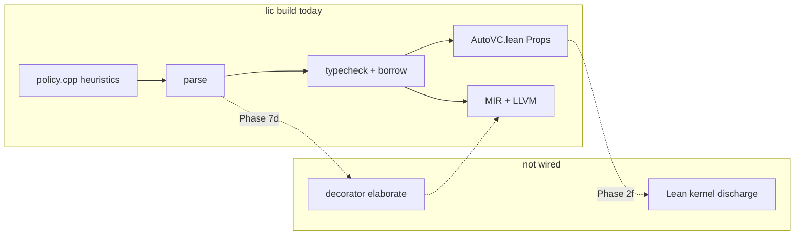

# Provability gaps (current compiler)

**Last updated:** 2026-05-16  
**Audience:** contributors, package authors, anyone relying on `lic build` as a proof certificate  

Li’s **north star** is: user logic is proved before ship; runtime failures for proved programs → **~0%**. That is the **target**, not a complete description of **`lic` today**.

**Policy vs implementation:** [Strict by default](../ecosystem/strict-by-default.md) — there is **no optional provability** by default. Rows below are **compiler maturity** (what is not wired yet), **not** permission for users to turn proof off without an explicit `li.toml` / documented downgrade.

This page is the **honest inventory** of what is **not** fully proved or not yet wired. When a gap closes, update this file in the **same PR** as the implementation.

**Related:** [Verification overview](overview.md) · [Master plan — Doc phase & compiler task map](../superpowers/plans/2026-05-14-li-master-plan.md#documentation--provability-honesty-cross-cutting) · [Trusted axioms](../semantics/README.md)

---

## Summary (read this first)

| | Target (spec) | Today (`lic` on `dev`) |
|---|----------------|-------------------------|
| **`lic build` = proof certificate** | Lean 4 kernel closes all VCs | **No** — parse, policy strings, typecheck, borrow, LLVM link only |
| **`lic check`** | Fast IDE feedback | **Yes** — no Lean, not a certificate |
| **Parallel disjointness** | Lean + structured proofs | **Partial** — substring heuristics in `policy.cpp` |
| **Index bounds (release)** | Refinement / proved → no user traps | **Partial** — MIR/runtime paths still evolving |
| **Decorators (`@parallel`, …)** | Compile-time elaboration + proofs | **Partial** — parse + policy (7d-a/e); no MIR lowering yet |
| **Math / linalg surface** | Static shapes, compile-time lowering | **Not started** (2i / 7e) |
| **Zero user runtime errors** | All above + 2f gate | **In progress** — see table below |

!!! warning "Do not overclaim in docs or packages"
    Until **Phase 2f** lands, saying “`lic build` proves your program in Lean” is **aspirational**. Prefer: “`lic build` runs the current static gate; see [provability gaps](provability-gaps.md).”

---

## Gap register

Status legend: **Missing** · **Stub** · **Partial** · **CI only** · **Done**

| ID | Area | Spec / promise | Current state | Phase | How we know |
|----|------|----------------|---------------|-------|-------------|
| **G-lean** | Lean 4 gate | `lic build` fails if any VC open | **Partial** — auto `_proved` for `True`, literal `decreases`, MIR-witnessed `ensures` (incl. `index_refinement`); `sqrt_contract` float VCs open | **2f** | `contracts_discharge_corpus.sh`, `check-autovc-open-goals.sh` |
| **G-vc** | VC generation | Contracts → proof obligations | **Partial** — auto `_proved` + `lic verify witnessed_ensures=` / `mir_return_linked=`; **E0303** rejects `ensures true` on value returns; **call-site callee `requires`** + **refinement param VCs** in `AutoVC.lean` (literal / const-local discharge); `sqrt_open_bound` float `abs` open | **2e** | `vc_emit_lean.cpp`, `vc_witness.cpp`, `call_requires.cpp`, `contracts_discharge_corpus.sh` |
| **G-par** | `parallel for` safety | Proved iteration independence | **Partial** — AST `check_module_policies` + string exploit patterns in `policy.cpp` | **7b**, **7d-c** | `race_shared_memory`, `decorator_exploits` |
| **G-stdlib** | Prelude / std seal | User cannot shadow builtin or `std/` names | **Partial** — `check_stdlib_seal` + `resolve_imports` for `std.*` / workspace; cycle detect at load | **4s** | `li-tests/stdlib_seal/`, `li-tests/modules/` |
| **G-dec** | Execution decorators | Static elaboration; reserved names; no runtime | **Partial** — parse + policy + `MirFn.decorators` tags; prelude table shared | **7d** | `decorator_exploits/`, `decorators/` |
| **G-math** | Math / `A @ B` | Shape errors at compile time; no user `simd(...)` | **Partial** — 1d `float` `@` → `ArrayDotF64` LLVM loop | **2i**, **7e** | `li-tests/math_linalg/` |
| **G-bnd** | Bounds in release | No reliance on `li_bounds_fail` for proved indices | **Partial** — architecture lists MIR bounds; not full refinement | **2e**, **3** | [Architecture](../architecture/overview.md); codegen paths |
| **G-def** | `def` / `object` / visibility | Handbook surface | **Partial** — `def`, `object`, field `private`/`public`; no methods/`self`; `import` parse-only | **2g** | `li-tests/encapsulation/` |
| **G-oop** | Full OOP | Methods, traits, inheritance, cross-module encapsulation | **Missing** — roadmap [2026-05-20-li-oop-roadmap.md](../superpowers/plans/2026-05-20-li-oop-roadmap.md); **2g** = records only | **2j** | Future `encapsulation/def_method*.li`, `trait_*.li` |
| **G-math-syn** | Python-math (`**`, `for`, …) | Ergonomic surface | **Partial** — `%`, `//`, `**` on `int`; `for`/`range` open | **2h** | `li-tests/math_syntax/` |
| **G-ann** | Deferred annotations (PEP 649) | Lazy resolve at check | **Missing** — shown in pipeline diagram as planned | **4** | Not in compiler tree |
| **G-gpu** | `@gpu` / device buffers | Separate address space proofs | **Missing** | **3+**, **7d** | Spec Phase 3+ |
| **G-async** | `@async` / `raises Async` | Structured concurrency proofs | **Partial** — `@async` requires `raises Async`; await not parsed | **2+**, **7d** | `li-tests/effects/` |
| **G-net** | `raises Net` | Trusted syscall surface | **Partial** — effect propagation + `trusted.lean` axioms; no codegen | **H**, **2f** | `li-tests/effects/net_*.li` |
| **G-trust** | Trusted base growth | Only `trusted.lean` | **Stub** — file exists; `Core.lean` / `MIR.lean` **planned** | **2f** | [semantics/README.md](../semantics/README.md) |
| **G-meta** | Compiler correctness | C++ compiler ≡ Lean semantics | **Missing** (research) | long-term | Not started |
| **G-hw** | Hardware / FP | Model vs IEEE / CPU bugs | **Axiomatic** | — | Documented limit |
| **G-wrong-spec** | User contracts | Correct theorem | **Social** — tool cannot fix | — | Review culture |
| **G-narrow** | Narrowing conversions | Ariane-class truncations rejected without proof | **Partial** — policy rejects `cast[`; width types + proved narrowing pending | **2e** | `historic_ariane5_narrowing.li` |
| **G-authz** | Capability / IDOR | Object capabilities in OS services | **Missing** | OS phase | `historic-bugs.toml` firefly-iii-idor |

---

## `lic build` today (actual pipeline)

What **`lic build`** runs **now** (see `compiler/lic/main.cpp`):

1. `check_source_policies()` — string/heuristic policy  
2. `parse_module()`  
3. `typecheck_module()` + borrow  
4. `compile_module()` → MIR → LLVM → link `li_rt`  
5. `write_vcs_lean()` → `build/generated/AutoVC.lean` (typed `Prop` obligations)  

**`lic verify`** / `LI_BUILD_VERIFY_LEAN=1`: VC counts + optional `lake build` on `docs/semantics` — see `compiler/verify/`.

What **`lic build`** does **not** run yet (unless `LI_BUILD_VERIFY_LEAN=1` and Lean 4 installed):

- Lean 4 kernel discharge of non-trivial ensures  
- Lean 4 kernel as default hard gate  
- Decorator elaboration  
- Math-shape checking beyond ordinary types  

---

## Runtime vs compile-time (honest)

| Mechanism | Intended end state | Today |
|-----------|-------------------|--------|
| Type / borrow errors | Compile-time only | **Mostly** at typecheck |
| `parallel for` races | Compile-time reject | **Heuristic** policy + tests |
| Out-of-bounds | Compile-time proof | **May** still hit `li_bounds_fail` in debug paths |
| Decorators | Never interpreted at run time | **N/A** — not executed; not elaborated yet |
| `li_panic` / contract fail | No user path in proved release | **Runtime** hooks exist in `li_rt` |
| OpenMP | Native threads | **Runtime** library (not user logic validation) |
| Fuzz / TSan | Find compiler bugs | **CI optional** — not user proof |

**Goal unchanged:** shrink the right-hand column until user logic never depends on the runtime column for correctness.

---

## Tests vs proofs

| Suite | What it proves |
|-------|----------------|
| `li-tests/race_shared_memory/` | Policy + typecheck **reject** bad parallel patterns (not Lean) |
| `li-tests/decorator_exploits/` | **Planned** — reserved names, macro hijack (7d-e) |
| `li-tests/math_linalg/` | **Partial** — 1d float `@` lowering (2i/7e) |
| `li-tests/contracts_verify/` | **Partial** — `sqrt_contract` real float Props; `discharge_trivial.li` fully discharged (2f slice) |
| `li-tests/tooling/vc_emit_contracts.sh` | `sqrt_contract` AutoVC uses `≥` / `Float.abs`, not `True` stubs |
| `li-tests/tooling/discharge_trivial_lean.sh` | `discharge_trivial.li` → zero open Prop goals + `lake build` when Lean installed |
| `li-tests/prove_reject/` | Rejection of forbidden constructs (where present) |
| Fuzz (`compiler/fuzz/`) | Parser robustness — **not** end-to-end proof |

Passing **`./li-tests/run_all.sh`** means the **current** gate holds — not the full spec gate.

**Corpus inventory, run commands, and proof backlog for the master plan:** [proof-corpus-roadmap.md](proof-corpus-roadmap.md).

---

## Documentation that must stay aligned

When editing handbook pages, do **not** imply features beyond this register without a “**Status:** implemented” note.

| Doc | Alignment action |
|-----|------------------|
| [Contracts and proofs](../language/contracts-and-proofs.md) | Points here for `lic build` vs Lean |
| [Build pipeline](../compiler/build-pipeline.md) | Lean stage marked *planned* |
| [Why provable](../compiler/why-provable.md) | Links here under honest limits |
| [Language overview](../language/overview.md) | “Status honesty” links here |
| [SIMD and parallel](../language/simd-parallel.md) | Note heuristic disjoint until 7d-c |
| Decorator / math spec stubs | Say “planned” until gaps closed |

---

## Closing gaps (priority)

Rough order from [master plan](../superpowers/plans/2026-05-14-li-master-plan.md) § *Compiler tasks vs proof gaps*:

1. **2e** — VC generation (**G-vc**)  
2. **2f** — Lean 4 in `lic build` (**G-lean**, **G-vc**, **G-trust**)  
3. **7b / 7d-c** — structured `disjoint=` (**G-par**)  
4. **7d** — decorator elaboration (**G-dec**)  
5. **2i / 7e** — math surface (**G-math**)  

**Documentation:** Phase **Doc** (Doc-a … Doc-e) in the master plan — update this file and handbook pages in the **same PR** as each compiler row moves to **Partial** or **Done**.
