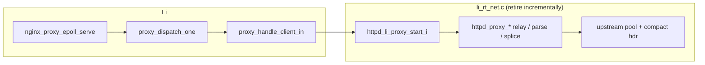

# Nginx-style reverse proxy → Li-native epoll (migration)

## Nginx model we mirror

From tier-5 harness `nginx_lb_proxy_prefix_conf` (see `benchmarks` / `lis-tier5` `bench_http.py`):

| Nginx directive | Li equivalent (today) |
|-----------------|----------------------|
| `upstream { keepalive 32; }` | `httpd_upstream_acquire_i` / `release_i` pool in `li_rt_net.c` |
| `proxy_http_version 1.1` | Request forwarded as HTTP/1.1 bytes on upstream socket |
| `proxy_set_header Connection ""` | `httpd_proxy_compact_req_hdr()` strips `Connection:` / `Proxy-Connection:` before upstream send |
| `proxy_buffering off` (loopback) | CL body relay via splice pump + epoll edge/level handlers |
| epoll accept + worker loop | **`nginx_proxy_epoll_serve`** in `packages/li-net-httpd/src/lib.li` |

## Architecture (current)



- **`httpd_set_li_proxy_mode_i(1)`** — C `httpd_try_drain_once` skips starting proxy; Li calls `httpd_li_proxy_start_i` after header parse.
- **Epoll tags** — `HTTPD_EPOLL_CLIENT_TAG` / `HTTPD_EPOLL_UP_TAG` (high 32 bits `0x80000000` / `0xc0000000`); matched in Li via `proxy_epoll_tag_is_*` without repeated extern tag helpers (borrow-safe).
- **Event batch** — `net_events_tagged_load_i` + `net_events_loaded_*_i` scratch (one `var ptr` pass per slot).

## Parity checklist

- [x] Strip client `Connection` toward upstream (nginx `Connection ""`)
- [x] Keep-alive upstream pool (32)
- [x] Tagged epoll dispatch (client vs upstream fd)
- [x] Li-owned epoll loop for proxy mode (`httpd_serve_port_root_proxy`)
- [ ] Full request/response relay in Li (`lib.li`) — still C
- [ ] Remove `httpd_epoll_serve_i` proxy branches from `httpd_try_drain_once`
- [ ] Delete static `httpd_proxy_forward` and unused C recv helpers
- [ ] Optional `LI_HTTPD_PROXY_LI=0` → `httpd_epoll_serve_i` for A/B (not wired yet)

## Removal plan (C → Li)

| Phase | Move to Li | Leave in seam (`seam.li` + `li_rt_net.c`) |
|-------|------------|-------------------------------------------|
| **P0** (done) | Epoll accept/dispatch loop | `tcp_*`, `epoll_*`, `httpd_li_proxy_*` glue |
| **P1** | Header compact + request line parse (already partial in `lib.li`) | splice optional |
| **P2** | Upstream response header parse + CL/chunked state machine | `tcp_recv_nb_i` / `tcp_send_nb_i` |
| **P3** | Relay pump (replace `httpd_proxy_splice_cl_i`) | `splice` syscall wrapper only |
| **P4** | Upstream pool bookkeeping | `connect` / `close` |

After **P4**, `li_rt_net.c` proxy section shrinks to syscall shims; no product logic in `.c`.

## Build / bench

```bash
cd lic
LI_REPO_ROOT=$PWD ./scripts/build.sh
LI_REPO_ROOT=$PWD ./build/compiler/lic/lic build packages/li-net-httpd/src/lib.li -o build/li-httpd
LI_HTTPD_BIN=$PWD/build/li-httpd python3 <benchmarks>/vendor/lis-tier5/benchmarks/tier5_http/harness/bench_http.py proxy_loopback --profile ci
```

**Evidence (2026-05-22, Li epoll path):** `proxy_loopback` ci ~56.5k li vs ~77.7k nginx (~0.73×). C-only hot path was ~58k (~0.77×); gap is Li dispatch overhead — expected until relay moves to Li and LLVM path matures.

## References

- `runtime/li_rt_net.c` — `httpd_proxy_compact_req_hdr`, `g_li_proxy_mode`, `httpd_li_proxy_*`
- `packages/li-net-httpd/src/lib.li` — `nginx_proxy_epoll_serve`, `proxy_dispatch_*`
- `std/runtime/seam.li` — trusted extern surface (extend only with manifest + `trusted_extern.cpp`)
